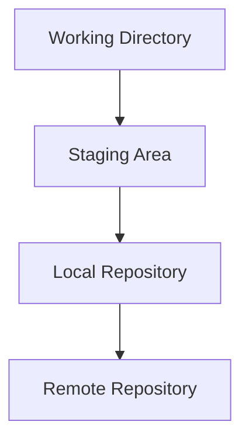
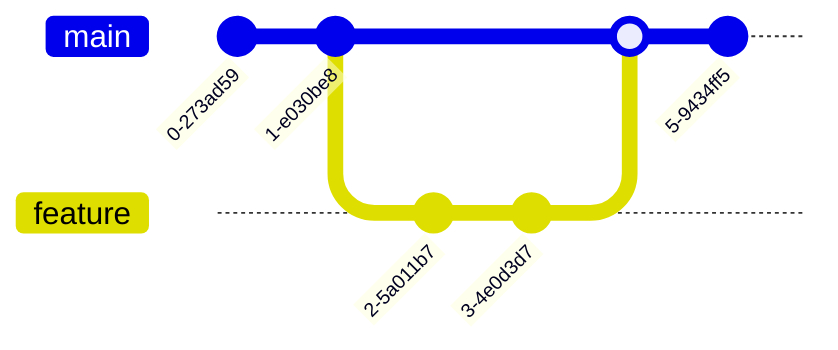
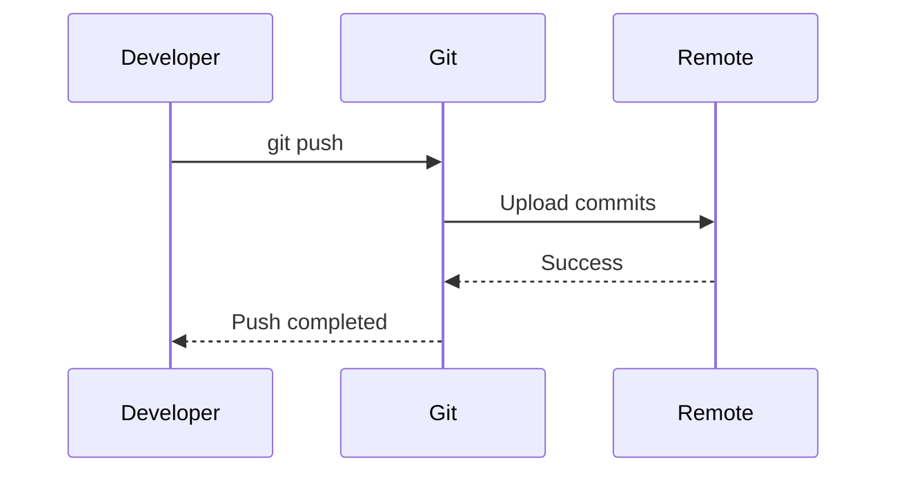
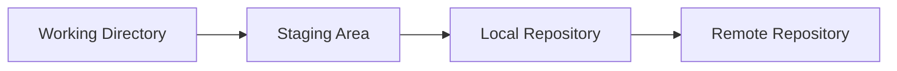

# Markdown Formatter Stress Test

This file is designed to test **Markdown rendering and formatting support**.

It contains:

- Standard Markdown
- GitHub Flavored Markdown (GFM)
- Tables
- Code blocks
- Bash commands
- Blockquotes
- Links
- Images
- Task lists
- Footnotes
- HTML
- Collapsible sections
- Math / LaTeX
- Mermaid diagrams
- Emoji
- Escaping
- Front matter
- Advanced Markdown extensions

---

# 1. Headings

# Heading 1

## Heading 2

### Heading 3

#### Heading 4

##### Heading 5

###### Heading 6

---

# 2. Paragraphs

This is a normal paragraph.

This is another paragraph.

This paragraph contains **bold text**, *italic text*, ***bold italic text***, and ~~strikethrough text~~.

This contains `inline code`.

---

# 3. Text Formatting

**Bold text**

*Italic text*

***Bold and italic text***

~~Strikethrough text~~

`inline code`

**Bold with `inline code` inside**

*Italic with **bold** inside*

---

# 4. Escaping Markdown Characters

\*This should NOT be italic\*

\# This should NOT be a heading

\- This should NOT become a list

\[This should NOT become a link\]

\`This should NOT become code\`

Characters:

\* \_ \# \+ \- \. \! \[ \] \( \) \{ \} \| \> \`

---

# 5. Unordered Lists

- Item 1
- Item 2
- Item 3

Alternative syntax:

* Item A
* Item B
* Item C

Another alternative:

+ Item X
+ Item Y
+ Item Z

---

# 6. Ordered Lists

1. First item
2. Second item
3. Third item

---

# 7. Nested Lists

- Git
  - Repository
  - Commit
  - Branch
    - Feature branch
    - Main branch
  - Remote
- GitHub
  - Pull Request
  - Issue
  - Actions

---

# 8. Mixed Lists

1. Git
   - `git init`
   - `git clone`
   - `git status`

2. Branching
   - `git branch`
   - `git switch`
   - `git merge`

3. Remote
   - `git fetch`
   - `git pull`
   - `git push`

---

# 9. Task Lists

- [x] Install Git
- [x] Create repository
- [ ] Create feature branch
- [ ] Make changes
- [ ] Commit changes
- [ ] Push branch

Nested checklist:

- [x] Git
  - [x] Repository
  - [x] Commit
  - [ ] Rebase
- [ ] GitHub
  - [ ] Pull Request
  - [ ] Code Review

---

# 10. Blockquotes

> This is a blockquote.

> This is a multiline blockquote.
> It contains multiple lines.

Nested blockquote:

> Outer quote
>
> > Nested quote
>
> Back to the outer quote.

---

# 11. Blockquote with Formatting

> **Important:** Always check `git status` before committing.

> **Warning:** `git reset --hard` can discard uncommitted changes.

> *This is italic inside a blockquote.*

---

# 12. Links

[Git](https://git-scm.com/)

[GitHub](https://github.com/)

<https://git-scm.com/>

<https://github.com/>

Email:

<example@example.com>

Reference-style link:

[Git documentation][git-docs]

[git-docs]: https://git-scm.com/docs

---

# 13. Images


Reference-style image:

![Example image][example-image]

[example-image]: https://via.placeholder.com/400x200.png

---

# 14. Horizontal Rules

---

***

___

---

# 15. Code

## Inline Code

Run `git status` to check the repository.

Use `git add .` to stage all changes.

## Plain Code Block

```
This is a plain code block.
It has no language specified.
```

## Bash

```bash
git status
git add .
git commit -m "Add feature"
git push origin main
```

## Shell

```shell
echo "Hello World"
pwd
ls -la
```

## JavaScript

```javascript
const message = "Hello World";
console.log(message);
```

## Python

```python
def hello():
    print("Hello World")

hello()
```

## JSON

```json
{
  "name": "markdown-test",
  "version": "1.0.0",
  "enabled": true
}
```

## YAML

```yaml
name: markdown-test
version: 1.0.0
enabled: true
```

## SQL

```sql
SELECT *
FROM users
WHERE active = true
ORDER BY created_at DESC;
```

## HTML

```html
<div class="container">
    <h1>Hello World</h1>
</div>
```

---

# 16. Code Block with Long Command

```bash
git commit -m "Add authentication flow and update documentation for the new login implementation"
```

---

# 17. Code Block with Special Characters

```bash
echo "Hello $USER"
echo 'Single quotes'
echo "Double quotes"
echo "Symbols: ! @ # $ % ^ & * ( )"
```

---

# 18. Tables

| Command | Description |
|---|---|
| `git status` | Show repository status |
| `git add` | Stage changes |
| `git commit` | Create a commit |
| `git push` | Push commits |

---

# 19. Table Alignment

| Left | Center | Right |
|:---|:---:|---:|
| A | B | C |
| Git | GitHub | GitLab |
| 123 | 456 | 789 |

---

# 20. Complex Table

| Command | Purpose | Safe? | Example |
|---|---|---|---|
| `git status` | Check changes | Yes | `git status` |
| `git add` | Stage changes | Yes | `git add .` |
| `git commit` | Save snapshot | Yes | `git commit -m "message"` |
| `git reset` | Move HEAD | Depends | `git reset HEAD~1` |
| `git reset --hard` | Discard changes | ⚠️ No | `git reset --hard HEAD` |

---

# 21. Long Text Inside Table

| Command | When to use it | Important note |
|---|---|---|
| `git fetch` | When you want to download remote changes without modifying your current branch | It updates remote-tracking references but does not merge changes into your working branch |
| `git pull` | When you want to download and integrate remote changes | It generally performs a fetch followed by integration |
| `git revert` | When you need to undo a commit safely on a shared branch | It creates a new commit that reverses the previous change |

---

# 22. Footnotes

Git is a distributed version control system.[^1]

Git was originally created by Linus Torvalds.[^2]

You can use footnotes to provide additional context.[^note]

[^1]: This is a footnote about Git.

[^2]: Git was initially developed in 2005.

[^note]: This is a named footnote.

---

# 23. Automatic Links

https://example.com

https://github.com

---

# 24. Emoji

🚀

✅

❌

⚠️

🔥

💡

🐛

🎯

Git is awesome! 🚀

Git command completed successfully. ✅

Warning! ⚠️

---

# 25. Emoji Shortcodes

:rocket:

:white_check_mark:

:x:

:warning:

:bulb:

:bug:

:fire:

---

# 26. HTML

<div>
This is HTML inside Markdown.
</div>

<p>This is an HTML paragraph.</p>

<strong>HTML bold</strong>

<em>HTML italic</em>

<mark>Highlighted text</mark>

---

# 27. HTML Line Break

Line one<br>
Line two

---

# 28. HTML Horizontal Rule

<hr>

---

# 29. HTML Details / Collapsible Section

<details>
<summary>Click to expand</summary>

This content is hidden until expanded.

You can put Markdown inside here.

```bash
git status
```

</details>

---

# 30. Details with Summary

<details>
<summary>Advanced Git command</summary>

```bash
git rebase -i HEAD~3
```

Use interactive rebase when you need to edit, reorder, combine, or remove recent commits.

</details>

---

# 31. Keyboard Keys

Press <kbd>Ctrl</kbd> + <kbd>C</kbd> to stop a process.

Press <kbd>Ctrl</kbd> + <kbd>Shift</kbd> + <kbd>P</kbd> to open the command palette.

---

# 32. Subscript

H<sub>2</sub>O

CO<sub>2</sub>

---

# 33. Superscript

x<sup>2</sup>

10<sup>3</sup>

---

# 34. Highlight

<mark>This text should be highlighted.</mark>

---

# 35. Inserted and Deleted Text

<ins>This text was inserted.</ins>

<del>This text was deleted.</del>

---

# 36. HTML Comments

<!-- This comment should not be visible in the rendered Markdown. -->

Visible text after the comment.

---

# 37. Math / LaTeX

## Inline Math

Einstein's equation is $E = mc^2$.

A quadratic equation is $ax^2 + bx + c = 0$.

## Block Math

$$
E = mc^2
$$

Another equation:

$$
\sum_{i=1}^{n} i = \frac{n(n+1)}{2}
$$

Matrix:

$$
\begin{bmatrix}
1 & 2 \\
3 & 4
\end{bmatrix}
$$

---

# 38. Mermaid



---

# 39. Mermaid Git Workflow



---

# 40. Mermaid Sequence Diagram



---

# 41. Git Workflow Diagram Using Text

```text
Working Directory
       |
       | git add
       v
Staging Area
       |
       | git commit
       v
Local Repository
       |
       | git push
       v
Remote Repository
```

---

# 42. Git Command Reference

> [!NOTE]
> `git status` is one of the safest commands to run at almost any point in a Git workflow.

> [!TIP]
> Run `git status` frequently while learning Git.

> [!IMPORTANT]
> Understand what `git reset` does before using it.

> [!WARNING]
> `git reset --hard` can permanently discard uncommitted changes.

> [!CAUTION]
> Do not blindly force-push to a shared branch.

---

# 43. Nested Formatting

> **Important:** This contains **bold**, *italic*, `inline code`, and a [link](https://git-scm.com/).

- **Bold item**
- *Italic item*
- `Code item`
- [Link item](https://example.com)
- ~~Deleted item~~

---

# 44. Mixed Content

## `git status`

> **Purpose:** Check the current state of your repository.

Use:

```bash
git status
```

It shows:

- Modified files
- Staged files
- Untracked files

| Information | Shown by `git status` |
|---|---|
| Modified files | Yes |
| Staged files | Yes |
| Commit history | No |
| Remote branches | Limited |

---

# 45. Very Long Paragraph

Git is a distributed version control system that allows developers to track changes to source code, create branches, collaborate with other developers, inspect project history, revert changes, merge independent lines of development, and synchronize local repositories with remote repositories such as GitHub, GitLab, or Bitbucket. This paragraph is intentionally long to test how the Markdown renderer handles line wrapping, paragraph width, whitespace, and text flow across the page.

---

# 46. Long List

- First item with a reasonably long description explaining what this item represents.
- Second item with another reasonably long description explaining the purpose of the item.
- Third item containing `inline code`, **bold text**, and *italic text*.
- Fourth item containing a [link](https://example.com).
- Fifth item containing multiple concepts:
  - Nested item one
  - Nested item two
  - Nested item three
    - Deeply nested item
    - Another deeply nested item

---

# 47. Blockquote with Code

> **Example**
>
> Run the following command:
>
> ```bash
> git status
> ```
>
> Then inspect the output.

---

# 48. Code Inside List

1. Check the repository:
   ```bash
   git status
   ```

2. Stage the files:
   ```bash
   git add .
   ```

3. Commit the changes:
   ```bash
   git commit -m "Update documentation"
   ```

---

# 49. Table with Formatting

| Type | Example | Result |
|---|---|---|
| **Bold** | `**text**` | **text** |
| *Italic* | `*text*` | *text* |
| `Code` | `` `code` `` | `code` |
| ~~Strike~~ | `~~text~~` | ~~text~~ |
| [Link](https://example.com) | `[Link](...)` | [Link](https://example.com) |

---

# 50. Escaped Table Characters

| Character | Markdown escape |
|---|---|
| `|` | `\|` |
| `*` | `\*` |
| `_` | `\_` |
| `#` | `\#` |

Example:

This is a literal pipe: \|

---

# 51. Empty Lines

Paragraph one.

Paragraph two.


Paragraph three after multiple blank lines.

---

# 52. Special Characters

! @ # $ % ^ & * ( ) - _ = + [ ] { } | \ : ; " ' < > , . ? / ~ `

---

# 53. Unicode

English — em dash

English – en dash

“Smart quotes”

‘Single smart quotes’

© Copyright

™ Trademark

® Registered

→ Arrow

← Arrow

↑ Arrow

↓ Arrow

✓ Check

✗ Cross

⚠ Warning

---

# 54. Reference Links

Here are several [Git commands][git].

You can also visit [GitHub][github].

[git]: https://git-scm.com/

[github]: https://github.com/

---

# 55. Nested Blockquotes + Lists

> ## Git Workflow
>
> Follow these steps:
>
> 1. Check your status.
> 2. Stage your changes.
> 3. Commit your changes.
>
> ```bash
> git status
> git add .
> git commit -m "message"
> ```

---

# 56. Nested Lists + Tables

- Git Commands
  - Basic
    - `git init`
    - `git clone`
  - Branching
    - `git branch`
    - `git switch`
  - Remote
    - `git fetch`
    - `git pull`
    - `git push`

| Command | Category |
|---|---|
| `git init` | Basic |
| `git branch` | Branching |
| `git push` | Remote |

---

# 57. Raw HTML Table

<table>
<tr>
<th>Command</th>
<th>Description</th>
</tr>
<tr>
<td><code>git status</code></td>
<td>Show repository status</td>
</tr>
<tr>
<td><code>git log</code></td>
<td>Show commit history</td>
</tr>
</table>

---

# 58. HTML Styling Test

<div align="center">

# Centered Heading

This content is centered using HTML.

</div>

---

# 59. Definition List

Git
: A distributed version control system.

Repository
: A directory containing Git's version history.

Commit
: A snapshot of changes in a repository.

---

# 60. Abbreviation

HTML
: HyperText Markup Language

CSS
: Cascading Style Sheets

Git
: Distributed version control system

---

# 61. Footnote with Formatting

This is a footnote test.[^formatted]

[^formatted]: This footnote contains **bold**, *italic*, and `code`.

---

# 62. Link with Formatting

[**Bold link**](https://example.com)

[*Italic link*](https://example.com)

[`Code-style link`](https://example.com)

---

# 63. Image with Link

[](https://example.com)

---

# 64. Heading with Inline Elements

## `git status` — **Check Your Repository**

---

# 65. Extremely Long Code Line

```bash
git commit -m "This is an intentionally long commit message used to test horizontal scrolling and code block overflow behavior in Markdown renderers"
```

---

# 66. Multiple Code Blocks

```bash
git status
```

```bash
git add .
```

```bash
git commit -m "message"
```

```bash
git push origin main
```

---

# 67. Multiple Tables

| Command | Purpose |
|---|---|
| `git init` | Initialize |
| `git clone` | Clone |

| Command | Purpose |
|---|---|
| `git fetch` | Download |
| `git pull` | Download + integrate |

| Command | Purpose |
|---|---|
| `git merge` | Merge |
| `git rebase` | Rebase |

---

# 68. Callout Inside List

- Normal item
- Another item

  > [!NOTE]
  > This is a callout nested inside a list.

- Final item

---

# 69. Collapsible Advanced Example

<details>
<summary>Click to see the advanced Git example</summary>

### Interactive Rebase

```bash
git rebase -i HEAD~3
```

This allows you to edit the last three commits.

Possible actions:

- `pick`
- `reword`
- `edit`
- `squash`
- `fixup`
- `drop`

</details>

---

# 70. Raw Markdown Test

The following should appear as literal text:

\# Heading

\*italic\*

\*\*bold\*\*

\`code\`

\> quote

\- list

---

# 71. Final Combined Test

## Git Workflow

> [!TIP]
> Always inspect your changes before committing.

1. Check the repository:

   ```bash
   git status
   ```

2. Review changes:

   ```bash
   git diff
   ```

3. Stage changes:

   ```bash
   git add .
   ```

4. Review staged changes:

   ```bash
   git diff --cached
   ```

5. Commit:

   ```bash
   git commit -m "Add feature"
   ```

6. Push:

   ```bash
   git push origin main
   ```

| Step | Command | Purpose |
|---:|---|---|
| 1 | `git status` | Check state |
| 2 | `git diff` | Review changes |
| 3 | `git add .` | Stage changes |
| 4 | `git diff --cached` | Review staged changes |
| 5 | `git commit` | Create commit |
| 6 | `git push` | Upload commits |

> **Remember:** `git status` is safe to run at almost any time.

<details>
<summary>Advanced information</summary>

```bash
git log --oneline --graph --decorate --all
```



Math test:

$$
\text{Working Directory}
\xrightarrow{\text{git add}}
\text{Staging Area}
\xrightarrow{\text{git commit}}
\text{Repository}
$$

</details>

---

# END OF MARKDOWN STRESS TEST

If you can see this correctly, the renderer successfully reached the end of the test.
